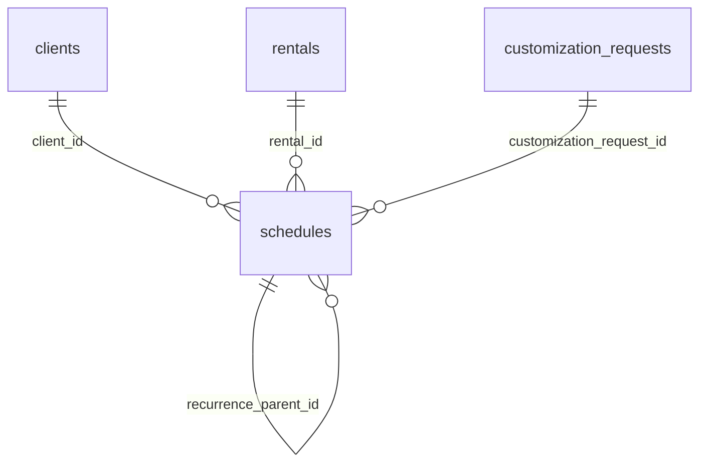

# ERD: Schedules (일정 관리)

> Phase 10 일정 관리 모듈 확장 (2025-11-02)

## 개요

`schedules` 테이블은 상담, 평가, 대여, 맞춤제작 등 AT-CMP 전반의 일정을 통합 관리합니다. 반복 일정(Recurring Event) 기능을 지원하기 위해 추가 필드가 도입되었습니다.

## 테이블 구조

| 컬럼 | 타입 | 설명 |
| --- | --- | --- |
| `id` | `uuid` (PK) | 일정 ID |
| `schedule_type` | `text` | 일정 유형 (`consultation`, `assessment`, `rental`, `customization`, `other`) |
| `client_id` | `uuid` (FK→`clients.id`) | 대상자 ID (선택) |
| `rental_id` | `uuid` (FK→`rentals.id`) | 대여 일정 연결 (선택) |
| `customization_request_id` | `uuid` (FK→`customization_requests.id`) | 맞춤제작 일정 연결 (선택) |
| `title` | `text` | 일정 제목 |
| `description` | `text` | 일정 설명 (JSON 문자열 포함 가능) |
| `start_time` | `timestamptz` | 시작 시각 |
| `end_time` | `timestamptz` | 종료 시각 (`end_time > start_time`) |
| `location` | `text` | 장소 |
| `participant_ids` | `jsonb` | 참석자 Clerk User ID 배열 |
| `reminder_minutes` | `integer` | 알림 시각 (분 단위, 0=알림 없음) |
| `status` | `text` | `scheduled`, `completed`, `cancelled`, `no_show` |
| `notes` | `text` | 비고 |
| `is_recurring` | `boolean` | 반복 일정 여부 (템플릿 일정) |
| `recurrence_rule` | `text` | iCal RRULE 형식 권장 (예: `FREQ=WEEKLY;INTERVAL=1`) |
| `recurrence_end_time` | `timestamptz` | 반복 일정 종료 시각 (선택) |
| `recurrence_count` | `integer` | 반복 생성 횟수 제한 (선택, 양수) |
| `recurrence_parent_id` | `uuid` (FK→`schedules.id`) | 반복 일정 하위 인스턴스가 참조하는 부모 ID |
| `recurrence_exception_dates` | `jsonb` | 반복 일정에서 제외할 ISO 날짜 배열 |
| `created_at` | `timestamptz` | 생성 시각 |
| `updated_at` | `timestamptz` | 수정 시각 |
| `created_by_user_id` | `text` | 생성자 Clerk ID |
| `updated_by_user_id` | `text` | 수정자 Clerk ID |

### 반복 일정 처리 규칙

- `is_recurring = TRUE`인 레코드는 반복 템플릿(시리즈 마스터)로 취급합니다.
  - 템플릿은 `recurrence_rule`을 반드시 포함해야 하며, `recurrence_parent_id`를 가질 수 없습니다.
  - 필요 시 `recurrence_end_time` 또는 `recurrence_count`를 지정하여 반복 범위를 제한합니다.
- 반복 템플릿에서 생성되는 개별 인스턴스는 `is_recurring = FALSE`, `recurrence_parent_id = 템플릿 ID`로 저장합니다.
- 예외 날짜(`recurrence_exception_dates`)에 명시된 ISO 날짜는 렌더링 시 제외합니다.

## 관계 다이어그램 요약

## 인덱스

- `idx_schedules_schedule_type`
- `idx_schedules_client_id`
- `idx_schedules_rental_id`
- `idx_schedules_customization_request_id`
- `idx_schedules_start_time`
- `idx_schedules_status`
- `idx_schedules_created_at`
- `idx_schedules_recurrence_parent_id` *(신규)*

## 마이그레이션 메모

- 반복 일정 필드는 `20251102_add_schedule_recurrence.sql` 마이그레이션으로 추가됩니다.
- `check_recurrence_rule_presence` 제약 조건은 반복 템플릿의 규칙 누락을 막습니다.

